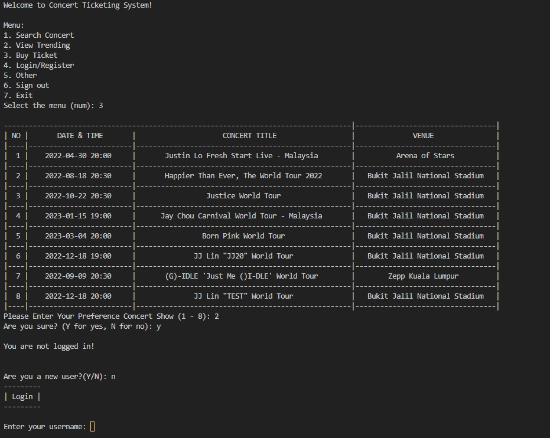

# Concert-Ticketing-System

## Description

This is a RSF1S3 project assignment for subject **_Object-Oriented Programming (OOP)_**.  
This project is a **[JAVA](https://www.java.com/en/)** console-based ticketing system for concert, so all output will be printed on console.

## Preview

### Preview 1   
  

### Preview 2    

## Developed by

1. [Joshua Koh](https://github.com/Joshuakme)
2. [Shia Chai Fen](https://github.com/Tiffany72)
3. [Wong Wei Hao](https://github.com/wongwh020216)
